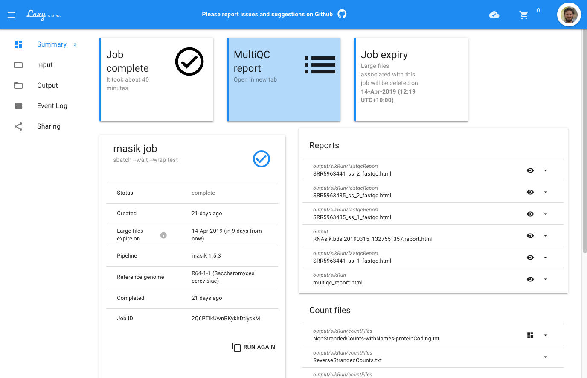

# Laxy

_Laxy_ is a web application designed to simplify launching routine genomic pipeline analyses.



```bash
git clone --recurse-submodules https://github.com/MonashBioinformaticsPlatform/laxy.git
```

## Frontend

The Laxy frontend is a Vue Single-Page Application that runs in the browser and communicates with a Laxy backend server.

### Development
```bash
cp -n .env.example .env
cd laxy_frontend
npm install
npm run build:dev
npm run server
open http://localhost:8002/
```

### Building for production

Create `.env` (see `.env.example`), change frontend variables as required (eg `LAXY_FRONTEND_*`).
Environment variables (eg as seen via the `env` shell command) will override variables read from `.env`.

```bash
npm run build:prod
```

These variables are used by the Webpack (`dotenv-webpack`) build to substitute references to `process.env.SOME_ENV_VAR`.

## Backend

The Laxy backend is a RESTful web service for managing pipeline jobs across various compute resources. 
It is based on Django and Celery.

### Setup

Dependencies:

* Python 3.6+

```bash
# Create a Python virtual environment, install package dependencies
python3.6 -m venv venv
source venv/bin/activate
pip install -U -r requirements.txt
# For development
pip install -U -r requirements-dev.txt
```

Run tests:
```bash
./manage.py test --noinput
```

Create a user and database on Postgres (run `psql`):
```postgresql
CREATE ROLE laxy WITH LOGIN PASSWORD 'blablafooword';
CREATE DATABASE laxy;
ALTER DATABASE laxy OWNER TO laxy;
GRANT ALL PRIVILEGES ON DATABASE laxy TO laxy;
```

Configuration is taken from a `.env` file.
Environment variables (eg `LAXY_*`) will override any variables defined in `.env`.
```bash
# Copy the example settings environment and edit as required,
# including the database name and password above. 
cp -n .env.example .env
vi .env
```

(To manually source the `.env` file into your login shell for some purpose, do `export $(grep -v '^#' .env | xargs)`).

Initialize the database, create an admin user:
```bash
# ./manage.py migrate contenttypes
./manage.py migrate
./manage.py makemigrations django_celery_results
./manage.py makemigrations sites
./manage.py makemigrations laxy_backend
./manage.py migrate --fake-initial
./manage.py createinitialrevisions
./manage.py makemigrations
./manage.py migrate

./manage.py createsuperuser

# You may want to prepopulate the database with some data
./manage.py loaddata laxy_backend/fixtures.json
```

### Run
```bash
source venv/bin/activate
DEBUG=yes python3.6 manage.py runserver 0.0.0.0:8000
```

#### Run Celery
```bash
celery -A laxy worker -B -E -Ofair -l info \
       --statedb=laxy_celery_worker.state
```

#### Run Celery Flower to monitor work queue
```bash
FLOWER_BASIC_AUTH=user:pass celery -A laxy flower --port=5555
```

OpenAPI / Swagger API (via drf_openapi): 
* Docs: http://localhost:8000/swagger/v1/
* JSON: http://localhost:8000/swagger/v1/?format=openapi

DRF CoreAPI docs: http://localhost:8000/coreapi/

### Docker

See notes on [running under Docker Compose](docs/docker.md)

#### Creating the UML diagram(s) for the Django models

```bash
./manage.py graph_models --pygraphviz -g -o docs/models_uml.png laxy_backend
```
