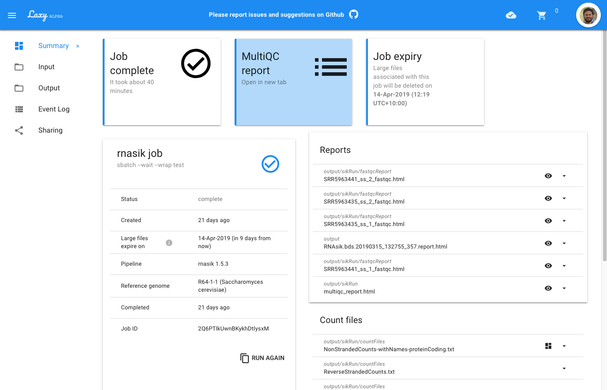

# Laxy


[](https://doi.org/10.5281/zenodo.3767371)

_Laxy_ is a web application designed to simplify launching routine genomic pipeline analyses.



## Project structure

This is a monorepo based on Django, Celery and Vue.js.

- `laxy` - top-level Django application handling settings, URL routing, and OpenAPI/Swagger endpoints.
  - `laxy/default_settings.py` - main Django settings. Environment variables prefixed with `LAXY_` override defaults here.
- `laxy_backend` - Django application for the REST API (job and file management) and Celery tasks.
- `laxy_pipeline_apps` - pipeline-specific applications, each with job script templates in `templates/job_scripts/<pipeline-name>/<version>`.
- `laxy_frontend` - Vue.js and TypeScript single-page application.
- `laxy_downloader` - Python application for downloading and caching files on compute nodes (invoked as `laxydl`).

## Quickstart

Laxy runs under Docker Compose for local development, testing, and deployment.

```bash
git clone --recurse-submodules https://github.com/MonashBioinformaticsPlatform/laxy.git
cd laxy

docker compose -f docker-compose.yml -f docker-compose.local-dev.yml build
docker compose --compatibility -f docker-compose.yml -f docker-compose.local-dev.yml up -d
```

The frontend can take a few minutes to build on first startup. Monitor progress with:

```bash
docker compose --compatibility -f docker-compose.yml -f docker-compose.local-dev.yml logs -f dev-frontend-server
```

Once running:

- **Frontend**: http://localhost:8002
- **Django admin**: http://localhost:8001/admin (default login: `admin` / `adminpass`)
- **REST API**: http://localhost:8001/api/v1/
- **OpenAPI docs**: http://localhost:8001/api/v1/schema/swagger-ui/

There is a convenience wrapper script `./compose.sh` that can be used in place of
`docker compose --compatibility -f docker-compose.yml -f docker-compose.local-dev.yml`.
It requires the `LAXY_ENV` environment variable to be set (e.g. `export LAXY_ENV=local-dev`).

## Development

### Docker Compose environments

The `LAXY_ENV` environment variable selects which overlay compose file is used by `./compose.sh`:

| `LAXY_ENV`  | Compose overlay                    | Purpose                     |
|-------------|------------------------------------|-----------------------------|
| `local-dev` | `docker-compose.local-dev.yml`     | Local development           |
| `dev`       | `docker-compose.dev.yml`          | Staging / dev server        |
| `prod`      | `docker-compose.prod.yml`         | Production                  |

For day-to-day development, use `local-dev`. In this mode Celery tasks run synchronously
inside the Django process (`CELERY_ALWAYS_EAGER=True`), so separate Celery workers are not needed.

### Building

Since your working copy of the source code is mounted inside the development container, you generally only need to rebuild containers when dependencies change (e.g. `requirements.txt`,
`package.json`):

```bash
docker compose -f docker-compose.yml -f docker-compose.local-dev.yml build
```

### Starting and stopping

```bash
# Start
docker compose --compatibility -f docker-compose.yml -f docker-compose.local-dev.yml up -d

# Stop
docker compose --compatibility -f docker-compose.yml -f docker-compose.local-dev.yml down
```

### Viewing logs

```bash
# All services
docker compose --compatibility -f docker-compose.yml -f docker-compose.local-dev.yml logs --tail 100

# Specific service
docker compose --compatibility -f docker-compose.yml -f docker-compose.local-dev.yml logs --tail 100 django
docker compose --compatibility -f docker-compose.yml -f docker-compose.local-dev.yml logs --tail 100 dev-frontend-server
docker compose --compatibility -f docker-compose.yml -f docker-compose.local-dev.yml logs --tail 100 fake-cluster
```

### Services

| Service                | Description                                |
|------------------------|--------------------------------------------|
| `django`               | Django backend and REST API (port 8001)    |
| `db`                   | PostgreSQL database (port 5433 on host)    |
| `rabbitmq`             | Message broker for Celery                  |
| `dev-frontend-server`  | Vue.js dev server with hot reload (port 8002) |
| `fake-cluster`         | Simulated compute cluster for local jobs   |
| `splash`               | Web scraper backend                        |

In `local-dev` mode, the Celery workers (`queue-high`, `queue-low`), `celery-beat`, `flower`,
and `nginx` services are disabled.

### Running tests

Unit tests run inside a dedicated test compose configuration:

```bash
docker compose -f docker-compose.test.yml up
docker compose -f docker-compose.test.yml down
```

### Debugging containers

```bash
# Django shell
docker compose --compatibility -f docker-compose.yml -f docker-compose.local-dev.yml exec django python3 manage.py shell

# Bash in Django container
docker compose --compatibility -f docker-compose.yml -f docker-compose.local-dev.yml exec django bash

# PostgreSQL shell
docker compose --compatibility -f docker-compose.yml -f docker-compose.local-dev.yml exec db psql -U postgres
```

## Configuration

Configuration is managed via environment variables, which can be set in a `.env` file.
See `.env.example` for all available options.

```bash
cp -n .env.example .env
```

Variables are prefixed with `LAXY_` as environment variables but referenced without the prefix
in Django settings (e.g. `LAXY_DEBUG` maps to the Django setting `DEBUG`).
Environment variables override values from `.env`.

## Laxy jobs

Laxy runs genomics pipeline jobs on remote compute resources and manages the associated files
and metadata. Often you'll need to debug the outcome of a job, initially launched via a `run_job.sh` script or equivalent (eg `laxy_pipeline_apps/nf-core-rnaseq/templates/job_scripts/nf-core-rnaseq/default/input/scripts/run_job.sh`).

In `local-dev` mode, jobs are executed inside the `fake-cluster` container. To inspect job output log:

```bash
docker compose --compatibility -f docker-compose.yml -f docker-compose.local-dev.yml \
  exec fake-cluster cat /scratch/laxy/{job_id}/output/run_job.out
```

> (you could also modify `docker-compose.local-dev.yml` so the `fake-cluster` uses a local host directory for job outputs)

In `dev` or `prod` mode, jobs typically run on remote machines via SSH.

## API documentation

OpenAPI / Swagger API (via drf-spectacular):

- Swagger UI: http://localhost:8001/api/v1/schema/swagger-ui/
- ReDoc: http://localhost:8001/api/v1/schema/redoc/
- Schema (YAML): http://localhost:8001/api/v1/schema/?format=yaml
- Schema (JSON): http://localhost:8001/api/v1/schema/?format=json

See `laxy_frontend/src/web-api.ts` for examples of frontend API usage.

## Customising

### Adding a new reference genome

Reference genomes follow the iGenomes naming and path layout, e.g. `Homo_sapiens/Ensembl/GRCh38`.
This serves as both the internal genome ID and the relative storage path.

- Add the genome to the frontend in `laxy_frontend/src/config/genomics/genomes.ts`
- Add the genome to the backend in `laxy_backend/data/genomics/genomes.py`
- (Optional) Add on-demand downloading to the appropriate `run_job.sh` script
  (via the `download_ref_urls` bash function), or pre-install at the correct path

See `docs/admin.md` for more details.

### Adding a new pipeline version

Follow the existing pipeline configurations in `laxy_pipeline_apps` for examples. See `docs/admin.md` for more details.

## Further documentation

- [Docker deployment notes](docs/docker.md) - database dumps, volume management, production deployment
- [Non-Docker development](docs/non-docker-development.md) - running the frontend and backend without Docker
- [Admin guide](docs/admin.md)
- [REST API notes](docs/restful_api.md)
